<!--
  Header & marquee ni handwritten SVG dalam /assets.
  CSS keyframes je, no library, no generator.
-->

<p align="center">
  
</p>

<p align="center">
  
</p>

<p align="center">
  <a href="https://jombina.site"></a>
  &nbsp;
  <a href="https://wa.me/60XXXXXXXXX"></a>
  &nbsp;
  <a href="https://www.threads.net/@YOUR-HANDLE"></a>
</p>

<br>

I build websites and internal systems for small businesses in Malaysia, end to end. Discovery, spec, build, deploy, handover. One person, no agency overhead, no subcontracting.

Right now I'm **open for projects**.

<br>

### What I take on

| | |
|:--|:--|
| **Landing pages** | Single page, built to convert. Usually 1 to 2 weeks. |
| **Business websites** | Company profiles, agent sites, portfolios. |
| **E-commerce** | Storefront with ToyyibPay / Billplz and EasyParcel wired in. |
| **Custom systems** | CRMs, admin panels, internal tools. |
| **Automation** | Removing the manual steps that eat your week. |

<br>

### Selected work

<details>
<summary><b>Jombina</b> &nbsp;·&nbsp; jombina.site</summary>

<br>

The studio itself. Also where I keep the internal CRM I built for lead pipeline, project stages, and semi-automated client reminders.

`Next.js` `Tailwind` `Supabase` `Vercel`

</details>

<details>
<summary><b>CekDoku</b> &nbsp;·&nbsp; free AI PDF proofreader</summary>

<br>

Public tool that proofreads PDF documents. Zero data retention, no accounts, no tracking. Shipped a Windows 95 themed variant too, purely because I wanted to.

`Next.js 14` `Gemini API`

</details>

<details>
<summary><b>Client builds</b> &nbsp;·&nbsp; agent & business sites</summary>

<br>

Insurance agent sites, company profiles, and e-commerce with local payment gateway and courier automation.

`Astro` `GSAP` `PHP MVC` `EasyParcel API`

</details>

<br>

### How I work

<details>
<summary>Process aku, kalau nak tau</summary>

<br>

```
01  DISCOVERY    structured Q&A sampai faham betul problem apa
02  PRD          detailed spec, phase by phase, markdown
03  BUILD        AI agents jadi build layer, aku jadi architect
04  VALIDATE     test setiap phase sebelum gerak next
05  HANDOVER     deploy, document, train, siap
```

Aku tak start coding sebelum ada PRD. Bunyi slow, tapi jimat banyak masa sebab tak payah rebuild benda yang salah scope.

</details>

<br>

### Stats

<p align="center">
  
</p>

<br>

---

<p align="center">
  <sub>
    <a href="https://jombina.site">jombina.site</a> &nbsp;·&nbsp;
    <a href="mailto:YOUR-EMAIL@example.com">email</a> &nbsp;·&nbsp;
    <a href="https://wa.me/60XXXXXXXXX">whatsapp</a>
  </sub>
</p>

<p align="center">
  <sub><i>header tu handwritten SVG dalam <code>/assets</code>. pergi baca. 👀</i></sub>
</p>
