<!--
  ┌─────────────────────────────────────────────────────────┐
  │  Nak tau macam mana? assets/header.svg dalam repo ni.    │
  │  Custom SVG + CSS keyframes. No library, no template.    │
  └─────────────────────────────────────────────────────────┘
-->

<p align="center">
  
</p>

<p align="center">
  
</p>

<p align="center">
  <a href="https://jombina.site"></a>
  <a href="https://wa.me/60XXXXXXXXX"></a>
  <a href="https://www.threads.net/@YOUR-HANDLE"></a>
  
</p>

<br>

<p align="center">
  <a href="https://jombina.site">
    
  </a>
</p>

<br>

## 🧩 What I Do

<table>
<tr>
<td width="33%" align="center">
<br>
<b>Websites</b><br>
<sub>Landing pages, company profiles, agent sites</sub>
</td>
<td width="33%" align="center">
<br>
<b>E-Commerce</b><br>
<sub>ToyyibPay, Billplz, EasyParcel integrated</sub>
</td>
<td width="33%" align="center">
<br>
<b>Custom Systems</b><br>
<sub>CRMs, admin panels, automation</sub>
</td>
</tr>
</table>

<br>

## 📊 The Numbers

<p align="center">
  
  
</p>

<p align="center">
  
</p>

<br>

## 🐍 Watch It Eat My Commits

<p align="center">
  <picture>
    <source media="(prefers-color-scheme: dark)" srcset="https://raw.githubusercontent.com/YOUR-USERNAME/YOUR-USERNAME/output/snake-dark.svg">
    <source media="(prefers-color-scheme: light)" srcset="https://raw.githubusercontent.com/YOUR-USERNAME/YOUR-USERNAME/output/snake-light.svg">
    
  </picture>
</p>

<br>

## 💼 Selected Work

<details open>
<summary><b>🟠 &nbsp;Jombina &nbsp;—&nbsp; jombina.site</b></summary>

<br>

One-man web studio serving Malaysian SMEs. End-to-end delivery from discovery call to deployment and handover.

`Next.js` &nbsp;`Tailwind` &nbsp;`Supabase` &nbsp;`Vercel`

</details>

<details>
<summary><b>📄 &nbsp;CekDoku &nbsp;—&nbsp; free AI PDF proofreader</b></summary>

<br>

Public tool that proofreads PDF documents using AI. Zero data retention, no accounts, no tracking. Also shipped a Windows 95 themed variant just for fun.

`Next.js 14` &nbsp;`Gemini API` &nbsp;`Bauhaus design system`

</details>

<details>
<summary><b>🏢 &nbsp;Client Websites &nbsp;—&nbsp; agent & business sites</b></summary>

<br>

Insurance agent sites, company profiles, and e-commerce builds with local payment gateway and courier automation wired in.

`Astro` &nbsp;`GSAP` &nbsp;`PHP MVC` &nbsp;`EasyParcel API`

</details>

<details>
<summary><b>⚙️ &nbsp;Internal CRM &nbsp;—&nbsp; lead & project tracking</b></summary>

<br>

Custom CRM for Jombina with lead pipeline, project stages, and semi-automated WhatsApp client reminders.

`Next.js 14` &nbsp;`Supabase` &nbsp;`TypeScript`

</details>

<br>

## 🧠 How I Work

<details>
<summary><b>Click sini kalau nak tau process aku</b></summary>

<br>

```
  01  DISCOVERY      structured Q&A sampai betul-betul faham problem
       ↓
  02  PRD            detailed spec in markdown, phase by phase
       ↓
  03  BUILD          AI agents as the build layer, me as the architect
       ↓
  04  VALIDATE       test every phase before moving to the next
       ↓
  05  HANDOVER       deploy, document, train, done
```

Aku tak start coding sebelum ada PRD. Bunyi macam slow, tapi actually save banyak masa sebab tak payah rebuild benda yang salah scope.

</details>

<br>

## 🏆 Trophies

<p align="center">
  
</p>

<br>

---

<p align="center">
  <b>Got a project? Let's talk.</b><br>
  <sub>
    <a href="https://jombina.site">jombina.site</a> &nbsp;·&nbsp;
    <a href="mailto:YOUR-EMAIL@example.com">email</a> &nbsp;·&nbsp;
    <a href="https://wa.me/60XXXXXXXXX">whatsapp</a>
  </sub>
</p>

<p align="center">
  <sub><i>psst — the header up top is a hand-written SVG in <code>/assets</code>. Go read it. 👀</i></sub>
</p>
